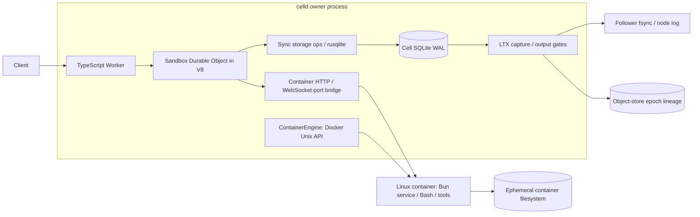
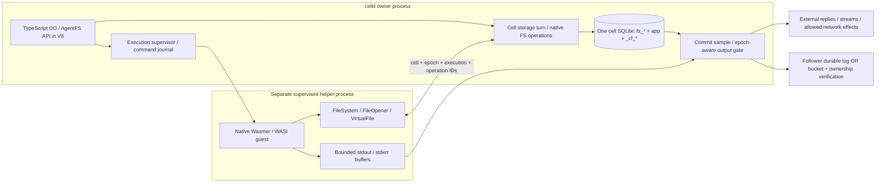

# A cell-owned AgentFS workspace for native Wasmer

Implementation follow-up: [Wasmer workspace service](packages/wasmer-sandbox/README.md)
and [qualification evidence](packages/wasmer-sandbox/qualification.md). The investigation
below records the original experiments; the follow-up defines the implemented contract.

Investigation date: 2026-09-22. Local branch: `codex/agentfs-wasmer-exploration`.

## 1. Verdict and evidence

**Build a constrained version if WASI/WASIX tools are sufficient. Start with a supervised Wasmer helper whose filesystem operations execute through the existing cell storage turn. Do not start by sharing a database file with the AgentFS Rust SDK, extracting all celld storage into a new coordinator, or emulating the entire Cloudflare sandbox service.**

The central storage hypothesis is feasible. The experiment in [examples/agentfs-wasmer](examples/agentfs-wasmer/README.md) uses a real TypeScript Durable Object, the published AgentFS Cloudflare adapter, a native Rust/Wasmer process, and ordinary guest filesystem calls. There is exactly one authoritative workspace: the AgentFS tables in that cell's celld-managed database. Bytes cross the syscall/RPC boundary; no workspace is exported, copied into a guest filesystem, or reconciled afterward.

Proven locally:

- DO writes `/workspace/input.txt`; a custom WASI guest reads it and writes `/workspace/output.txt`; the same DO reads the result through AgentFS, including **during the guest's execution** while the original `/exec` event is awaiting the helper.
- Basic read/write, positional seek and overwrite, one-writer append, rename, unlink, and 256 KiB chunked I/O pass. Three complete runs pass.
- `ctx.storage.sync()` executes on the real celld path. Killing both the dev supervisor and serving node, moving the entire runtime directory aside, and restarting preserves the acknowledged workspace through the remaining local object store.
- Killing the owner process during a guest command preserves an acknowledged file prefix, recovers the command as `interrupted`, and rejects the old execution token. Replaying a completed command ID returns its recorded result; reusing an ID with a different mode is rejected.
- Killing an infinite-loop guest leaves its previously committed file prefix. Cancellation is not rollback.
- **A real failure was retained:** AgentFS Cloudflare `truncate(32)` on a 25-byte file reports size 32 but both guest and DO reads return only 25 bytes. The adapter needs filesystem correctness work.

Not proven: multi-node/follower recovery, lease-loss fencing of native IPC, production helper isolation, complete POSIX semantics, concurrent guest/DO writers, guest networking/output batching, package execution over this adapter, or unmodified `@cloudflare/sandbox` on Wasmer. The prototype is deliberately a local experiment, not a production backend.

If the requirement is arbitrary Linux commands, native npm modules, normal platform Python wheels, or the existing sandbox image unchanged, **retain the Docker backend**. Wasmer does not make those artifacts Wasm-compatible. If the useful workload is curated Wasm tools plus TypeScript orchestration, the helper design avoids an unnecessary runtime/storage rewrite.

### Source baselines

All four repository roots were checked for instructions before source work. Wasmer's root instructions and referenced architecture/build/testing/security/contribution documents were read; Sandbox SDK's root instructions and architecture guidance were read. No upstream checkout was edited. No infrastructure was deployed.

| Source                                     | Inspected commit / artifact                              | Role                                                                        |
| ------------------------------------------ | -------------------------------------------------------- | --------------------------------------------------------------------------- |
| Local `ewhauser/celld`                     | `c91ca5436db5974e17b9a8abb3d216fe35737831`               | Source and rebuilt debug binary used in the experiment (`0.5.1-ewhauser.1`) |
| Requested `denoland/celld`                 | `42269c121c989c65c0638ab01f368baf18a5f0df`               | Fetched upstream main; compared with local fork                             |
| `tursodatabase/agentfs`                    | `0a014ebd4918615baff589ed17486e557e7c6a23`               | Current source/spec inspection                                              |
| `agentfs-sdk@0.6.4`                        | npm gitHead `3a5ed2b88e5d5a5f9b2c7fe02d012b50fd19e3c0`   | Experiment; Cloudflare adapter source has no diff against inspected main    |
| `wasmerio/wasmer`                          | `947414e9a1f32830fe89a45c8a0f4bdb4ccdc7c2`               | Current source inspection                                                   |
| Wasmer `7.4.0`, WASIX/virtual-fs `0.704.0` | crate VCS SHA `32b50f8b600efa8e2d5f88593c453139bf1ca222` | Pinned native experiment, recorded in Cargo.lock                            |
| Wasmer CLI                                 | official `v7.4.2` Darwin ARM64 release                   | Separate package availability/execution probes                              |
| `cloudflare/sandbox-sdk`                   | `b4aa661502f29bd1688399010b5c408ae89f8ffb`               | API, service, image and transport inspection                                |

The fork includes disk-removal/release changes absent from upstream; it is not mislabeled as upstream HEAD. Core `storage.rs`, JS storage bindings, runtime/pool, and container paths are unchanged by those fork changes; fork LTX/actor changes concern the existing disk-removal work. Source links below identify the actual inspected trees. The published Wasmer source was also read while building; do not assume main and the crate release are identical.

## 2. Current and proposed architecture

### Current celld + Sandbox SDK



The container's filesystem is separate from cell SQLite today. A container image and a Durable Object address do not create shared file state.

### Recommended first production shape



The production `turn` is an internal command path, not a public arbitrary-SQL endpoint. Initially it can reuse AgentFS TypeScript operations through cell dispatch, as the prototype does. A later Rust format adapter can enter the same serialized storage authority, using celld SQL primitives. Native Wasmer is alongside V8, never inside it.

“Same instance” here means one database lineage, one writer arbitration scheme, and coherent operation boundaries. It does not mean one JS object. The experiment does use one AgentFS JS object per residency; that is an implementation convenience.

## 3. Design comparison

| Approach                                               | Strength                                                                                                                  | Costs and correctness risks                                                                                                                                                                                | Assessment                                                                         |
| ------------------------------------------------------ | ------------------------------------------------------------------------------------------------------------------------- | ---------------------------------------------------------------------------------------------------------------------------------------------------------------------------------------------------------- | ---------------------------------------------------------------------------------- |
| Embedded Wasmer + extracted storage coordinator        | Lower transport overhead; native SQL can avoid JS encoding; independent storage scheduling possible                       | Broad change from isolate-owned `RefCell` state; synchronous JS needs blocking/coordinated access; lock-order and async transaction hazards; Wasmer panic/OOM affects celld; guest memory competes with V8 | Viable later if measured need justifies it; not the smallest first version         |
| Supervised Wasmer helper + native cell-scoped protocol | Crash/cancel isolation; explicit capabilities; bounded scheduling; keeps celld as owner; restart semantics simple         | Serialization/context switches; sync Wasmer metadata/open interfaces require dedicated blocking lanes; protocol authentication/fencing/lifecycle work                                                      | Recommended execution boundary                                                     |
| Helper + existing DO execution/storage path            | No production storage refactor; reuses current authorizer, transactions, commit sampling, gates, restoration; proven here | Public HTTP replies pay output gates per operation; JSON byte arrays expensive; V8 contention; cannot call through a closed input gate                                                                     | Best prototype and first functional milestone, not final high-throughput transport |
| Independent Turso/AgentFS Rust connection to cell file | Superficially few API changes                                                                                             | Unsupported mixed engines, different connection/pragma/cache ownership, paged restore bypass, durability sampling/fencing gaps                                                                             | Reject                                                                             |
| Docker + AgentFS filesystem service                    | Linux tool compatibility; existing Sandbox SDK service remains usable                                                     | Requires an actual mount/protocol integration, separate isolation work, larger runtime footprint                                                                                                           | Prefer if broad Linux compatibility is the deciding requirement                    |

Do not create a single-thread coordinator that receives `transactionSync` begin and then waits for a JS callback while that callback synchronously queues SQL back to the same blocked coordinator. Either execute storage on the current serialized turn, or design re-entrant transaction ownership explicitly. The first option already exists.

A second rusqlite connection is not intrinsically impossible. It must use the activation VFS, epoch and authorizer, integrate every write into commit sampling, and exclude writes while a DO transaction is open. `PRAGMA data_version` and the existing embedded-facet paths show that celld can observe another managed connection; they are not permission to reuse a file independently. `sync_sample` and event snapshots have subtly different position logic. One managed write connection in v1 avoids this class of accounting mistakes. [C1][C2][C3]

## 4. Source findings and integration points

### celld activation, storage ownership and output

1. Ownership/routing decisions live in `celld-logic`; `Actor` executes `ReadOwner`, `CasOwner`, `Restore`, and `StartRuntime` effects. Restoration precedes runtime publication. `Replication::restore` calls `LtxRepl::activate(ActivationOptions)` with epoch, predecessor and takeover context; predecessor log recovery and lineage selection precede restoring a takeover. [C4][C5]
2. `RuntimeManager::start_cell` resolves the class/script generation, obtains a placement from the script's isolate pool, obtains the activation's paged VFS if present, and calls `CellResidency::adopt` with `CellStorage { path, epoch, replicated_wake, vfs }`. `Worker::own_cell` / `adopt_cell` opens the database. JS harness `_instance` lazily constructs the class instance with a `DurableObjectState` and caches it for the residency. These are shared isolates with multiple cell realms/instances; the old top-of-file “one isolate per cell” comment in `js.rs` is not the controlling implementation. [C6][C7]
3. `WorkerInner` owns `storage::Cells`; each `OpenCell` owns a `rusqlite::Connection`, epoch and backing identity. `Cells` uses `RefCell` maps, **not a per-connection mutex**. `IsolateSlot::with` takes an async turn permit; `WorkerInner::lock` takes `v8::Locker` and installs the `Cells` pointer into thread-local `CURRENT_CELLS` for that turn. The storage follows the isolate across Tokio workers. It is not permanently thread-local, not per HTTP event, and cannot be called by an arbitrary Tokio task. `cells()` asserts if called outside a turn. [C1][C7]
4. `finish_open` installs celld schema, wake identity, SQLite budgets and the SQL authorizer. Steady-state journal mode is WAL with `synchronous=NORMAL`. `op_sql_cursor_start` → `sql_cursor_start_values` executes synchronous SQL; JS `transactionSync` uses `op_storage_transaction_control` → `transaction_control`. The connection commits on normal SQLite statement completion or explicit transaction commit; a whole HTTP event is not automatically one SQL transaction. Consume write cursors before publishing output. [C1][C2][C8]
5. `InFlight::gate_positions`, `storage::write_position` and `observed_position` classify writes and reads that can reveal unproven writes. `op_storage_sync` samples committed position + activation epoch during the turn and refuses an open explicit transaction. `EgressGate` / `GateTicket` feed the actor's existing output machinery. Error replies and later streaming chunks also need their applicable proof. [C2][C9]
6. `LtxRepl::await_durable` obtains a sequence ticket and wakes capture/shipping. `sync_cell` captures committed WAL with `celld_ltx::Db::sync` on a separate managed replication connection, protected by the replica mutex; it does not use V8's application connection from another task. A capture credits only tickets obtained before capture began. Positions are coverage labels, not LTX transaction IDs. Fleet proof requires follower durable storage; bucket proof requires upload and subsequent ownership verification. `output_gate::durable_reached` chooses that distinction; `Actor` executes `VerifyOwnership`. [C3][C5][C10]
7. Closing a residency closes its storage and invalidates epoch-scoped authority. LTX restore can install a sparse paged VFS, making raw path access particularly unsafe. Resource accounting and drain behavior must include a new native execution, not only JS event activity. [C5][C6]

**Exact new integration:** add a bounded execution registry keyed by cell/epoch/execution ID; an async JS `exec` host op; internal FS operations admitted into that cell's storage turn; an AgentFS transaction adapter; commit/observed-position sampling for those operations; a native output/egress ticket path using the existing gate; and cancellation/drain/memory accounting. Include generation identity for code swaps that can happen without a new ownership epoch. Never acknowledge command completion based solely on `connection.execute` succeeding.

Keep `ctx.storage.sql` and `transactionSync` synchronous: all their work still runs in one existing turn. Wasmer waits outside that turn. If storage is later extracted, synchronous JS semantics require either a safe synchronous coordinator interface or turn-exclusive access to the connection; they cannot silently become Promise-returning SQL.

### AgentFS is a format, not the Turso connection object

The 0.4 format consists of `fs_config` (chunk size/version), `fs_inode` (type/mode, link count, ownership, byte size, timestamps/nanoseconds/device metadata), `fs_dentry` (unique parent inode/name to inode), `fs_data` (inode/chunk index to BLOB), and `fs_symlink` (inode to target). Root inode is 1; default chunks are 4096 bytes. Directories have namespace entries and inode metadata, not normal content chunks. The complete specification also defines `kv_store` and `tool_calls` with timing/result/error fields. [A1]

The Cloudflare entry point exports an `AgentFS implements FileSystem`, created with `AgentFS.create(ctx.storage)`. It implements filesystem methods and random-access handles using `storage.sql.exec` plus `transactionSync`. It does **not** expose the standalone SDK's `kv` or `tools` objects, and does not initialize `kv_store` or `tool_calls`. Application SQL can add those tables deliberately. `examples/cloudflare` uses just-bash in the JS runtime, not Wasmer, FUSE, or a native shared mount. [A2][A3]

Important limitations of the Cloudflare adapter:

- `ensureRoot` unconditionally stamps `schema_version='0.4'`; it does not validate/migrate an older table layout. Initialization is multiple statements. Wrap new schema setup atomically and validate before opening imported data.
- `AgentFSFile.pread` collects available chunks without synthesizing sparse holes/EOF padding; `truncate` growth updates metadata without creating data. The retained test proves the resulting short read. Rust AgentFS's `pread` has explicit EOF bounds and zero filling and is useful reference code. [A2][A4]
- `fsync` is a no-op. In this integration, explicit durable sync must reach celld's barrier, not rely on that comment about automatic Cloudflare persistence.
- `resolvePath` walks names directly; it does not implement a full symlink-following/dot-component resolver. `lstat` is simply `stat`. Presence of `symlink`/`readlink` methods does not prove POSIX path semantics.
- `unlink` deletes the inode/data at link count zero even if an `AgentFSFile` still references it. Open-but-unlinked POSIX behavior is not implemented by keeping the JS handle alive. `pwrite` with a missing inode can read size as zero and write orphan chunks. Reject stale handles or implement open-reference retention.
- `rmdir` calls a multi-statement deletion helper without its own `transactionSync`; atomic rename/write methods do not establish atomicity for every operation. Concurrent append is not a provided atomic API.

The Rust SDK uses `turso::Builder`, `turso::Database/Connection`, async statements, and a `ConnectionPool` with one permit. Its local/sync database constructors own their engine lifecycle. Rust AgentFS also owns a dentry LRU cache. Its initialization changes `synchronous`; its `fsync` toggles that pragma and issues its own transaction. These are incompatible responsibilities for a direct transplant into celld's connection lifecycle. Reuse schema, inode/chunk algorithms, error conventions and conformance fixtures; port database execution, transaction management, durability and cache invalidation. Do not reuse `AgentFS::open(path)` against a running cell. [A4][A5]

**Can tables coexist? Yes, conditionally, and the experiment does.** celld reserves `_cf_*` plus LTX control tables through its authorizer. `fs_*`, `kv_store`, `tool_calls`, and uniquely named application tables can coexist. Reserve those library names in the application, keep all mutations on managed storage, and do not run a library “drop all tables” reset. There is one AgentFS root/config per cell under these unprefixed names. Do not blindly replace the cell database with a standalone file: celld also has legacy migration logic for historical `kv`, `alarms`, and `cell_metadata` names. [C1][A1]

**Can an existing AgentFS DB be imported? Yes as a controlled data/schema import; a turnkey importer was not implemented or tested.** Turso documents SQLite file compatibility but explicitly excludes mixed SQLite/Turso multiprocess access. Normal plaintext SQLite-format data need not be transformed into a new conceptual filesystem format. Encryption, opt-in incompatible engine features, sync/partial databases or old schemas may require export/decryption/materialization and a schema migration first. [A6]

Required procedure: stop source writers or obtain an engine-supported consistent read snapshot; fully materialize remote/partial state; checkpoint under the source engine or use its supported consistent export (never copy just a live main file and omit WAL). Inspect actual columns as well as version/chunk configuration. Export whitelisted AgentFS tables with BLOBs intact, preserving inode IDs, dentries, chunk indices, sizes, symlinks and relevant sequence high-water marks. Validate reachability, links, chunks, paths, no orphan references and schema compatibility. Load rows via managed cell transactions; for a large import use staging tables with bounded commits and a final short atomic publication while the workspace is unavailable. Publish the command/import record and await celld durability. Leave `_cf_*`, LTX tables, epoch/wake records and existing app state under celld's control. This one-time migration is distinct from copying between runtimes on every command.

### Wasmer path, descriptor, execution and network interfaces

`FileSystem: Send + Sync` supplies synchronous metadata, directory, create/remove and readlink methods; `rename` returns a future. `FileOpener::open` is synchronous. `VirtualFile` combines Tokio `AsyncRead`, `AsyncWrite`, `AsyncSeek` with synchronous `size`, `set_len`, timestamps and `unlink`. A remote backend therefore cannot simply make every method `async`. The prototype blocks only its dedicated native runner process while calling celld; production needs bounded blocking workers for synchronous calls and proper `Poll::Pending`/wake handling for async I/O. Never run that blocking HTTP implementation on V8 or a celld serving executor. [W1]

`WasiEnvBuilder::fs` installs a backing filesystem; `MountFileSystem::mount_with_source` composes separate roots. `preopen_vfs_dirs` creates **read-only** preopens at the pinned release; the experiment uses `add_preopen_build` with explicit read/write/create rights. The builder also requires the same engine used to compile the module. [W2][W3]

`path_open` → WASIX `path_open_internal` resolves dirfd/cwd/path via `WasiFs::get_inode_at_path*`, checks rights, configures the opener, and installs/caches an inode/FD. `fd_read_internal`/`fd_write_internal` bridge guest memory and file handles via asyncification; guest syscalls look synchronous. `fd_seek_internal` maintains descriptor offsets; the virtual file receives seek requests before I/O. Append uses a cached inode size on the WASIX side, so the backing authority must implement atomic append independently of that offset. Wasmer can share one backing file handle between several guest FDs; do not mistake that handle's original open flags for each FD's current append mode. [W4][W5]

For tools, `BinFactory`/`spawn_exec_wasm`/`spawn_load_module` load and compile Wasm, `spawn_exec_module` schedules execution, and package paths bring their own filesystem mounts/dependencies. This experiment loads one trusted `guest.wasm` into a native Cranelift `Store`, initializes WASI and calls `_start`. Supporting full subprocesses requires the normal WASIX process runner/task lifecycle and package resolver; it is not proven by a direct `_start` call. No arbitrary host `execve` is supplied. [W6]

Networking is separate from filesystem access: `sock_connect_internal` reaches `env.net()`, with `VirtualNetworking` and socket readiness interfaces. `PluggableRuntime` defaults to host networking if `host-vnet` is built; otherwise it uses `UnsupportedVirtualNetworking`. HTTP/package loaders are separate capabilities too. The probe uses `sys-minimal`, without host networking or host filesystem mounts. A production implementation must explicitly select denied/proxied network capabilities rather than trusting feature defaults. [W7]

## 5. API compatibility

These are three different targets:

1. **Familiar sandbox subset:** TypeScript `exec({program,args,cwd,env,timeoutMs})`, file APIs and a structured result. A direct celld adapter is smallest. Avoid interpreting a string as shell code until a verified shell package is configured.
2. **Unmodified `@cloudflare/sandbox`:** its `Sandbox extends Container` class uses container lifecycle, session initialization, files and command clients. HTTP is still the default transport in the inspected `sandbox.ts`; RPC is an available control path, despite architecture guidance describing it as primary. Supporting an unmodified SDK requires the container service protocol plus lifecycle/port hooks, not only similarly named TypeScript methods. [S1][S2]
3. **Existing image unchanged:** the service is Bun on Linux; `Session.initialize` uses `Bun.spawn(['bash','--norc'])`, persistent shell state, FIFOs and OS services. Linux image contents are not Wasm modules. This is unsupported by the proposed Wasmer backend. [S3]

Current celld path: `ctx.container.*` JS harness → `js/container.rs` native ops → `ContainerEngine` → Docker-compatible Unix API. `getTcpPort().fetch/connect` addresses the running service. Sandbox `execWithSession` uses its service client over HTTP or capnweb/WebSocket; it is distinct from the low-level Docker `ctx.container.exec` operation. `ContainerEngine::exec` creates/starts Docker exec processes and demultiplexes streams. Replacing only that method would not replace Sandbox SDK's Bun server or make its files durable. [C11][S1]

| Capability                                    | Existing celld Docker path (source-supported)                                          | Proposed Wasmer workspace                                                                                                                           |
| --------------------------------------------- | -------------------------------------------------------------------------------------- | --------------------------------------------------------------------------------------------------------------------------------------------------- |
| Program, arguments, cwd, env, exit status     | Works today                                                                            | **Requires adaptation** of API/runner; custom WASI args/cwd and normal exit are proven; arbitrary exit-code mapping/env combinations not yet tested |
| stdin/stdout/stderr                           | Works today                                                                            | **Requires adaptation**; stdout/stderr capture proven, stdin/TTY unverified                                                                         |
| Stream output, cancellation, timeouts         | Works today, event-lifetime caveats                                                    | **Requires adaptation**; helper kill/timeout proven; bounded streams and durability gates not implemented                                           |
| Files read/write/list, shared workspace       | Files work today on ephemeral container disk; shared DO filesystem requires adaptation | **Requires adaptation**; central round trip, listing/metadata, seek/basic append proven; sparse/truncate and handle gaps remain                     |
| Shell pipelines/redirection/subprocesses      | Works today through Linux Bash                                                         | **Requires compatible Wasm builds + adaptation**; pinned Bash pipeline works in stock CLI; custom FS/package/process integration unverified         |
| Sessions / persistent shell environment       | Works today                                                                            | **Requires adaptation**; v1 records cwd/env, creates a new guest per command; live shell state restoration unsupported                              |
| Python                                        | Works today in sandbox image                                                           | **Requires compatible Wasm build**; pinned Python package executes in stock CLI, adapter use unverified                                             |
| `cat`, `echo`, representative coreutils       | Works today                                                                            | **Requires compatible Wasm build**; Bash pipeline with `cat` and coreutils `echo` verified in CLI                                                   |
| Background processes                          | Works today, container lifecycle applies                                               | **Unsupported in v1**; requires execution pinning and process-tree supervision                                                                      |
| HTTP servers / preview ports                  | Works today with operator routing/configuration                                        | **Unsupported in v1**; Wasmer network capabilities and celld preview proxy need adaptation                                                          |
| Dependency installation                       | Works today for compatible container distro                                            | **Requires compatible Wasm build** and curated package policy; offline pure-language dependencies plausible, package installers here unverified     |
| Native Python extensions / native npm modules | Works today only for image platform/ABI                                                | **Requires compatible Wasm builds**; arbitrary ELF, `.so`, Node native addon and Docker execution **unsupported**                                   |
| Existing Sandbox Linux image                  | Works today                                                                            | **Unsupported**                                                                                                                                     |
| Unmodified Cloudflare Sandbox SDK on Wasmer   | Works today on Docker service                                                          | **Unverified / requires adaptation** of full service and lifecycle protocol; not a v1 promise                                                       |

Package probes were deliberately separate from the integration proof. Official Wasmer CLI 7.4.2 ran `wasmer/bash@=1.0.25 -- -c 'printf ...; printf ... | cat'` and `wasmer/coreutils@=1.0.25 --entrypoint echo -- coreutils-ok`, both exit 0. `python/python@=3.13.20` imported `sys,json` and exited 0, but reported **Python 3.13.15** internally. Package version is not necessarily interpreter version. Coreutils requires an explicit entrypoint. Package output and exact invocations are retained in the experiment. No native-extension installation or package execution on the custom filesystem was tested. [P1]

## 6. Transactions, concurrency, durability and failures

### Deadlock-free call graph and constrained writer policy

```mermaid
sequenceDiagram
  participant DO as DO event / V8
  participant H as Wasmer helper
  participant T as Cell storage turn
  participant R as Independent replication
  DO->>T: Commit inputs + command admission
  DO->>R: durability barrier
  R-->>DO: proof
  DO->>H: start execution
  Note over DO: await releases turn; no SQL transaction / input gate held
  H->>T: read or bounded mutation
  T->>T: validate execution; transactionSync; commit
  T-->>H: local result (production internal protocol)
  H->>T: next filesystem operation
  T-->>H: result
  H-->>DO: exit + buffered output
  DO->>T: terminal command record
  DO->>R: proof for final committed position + epoch
  R-->>DO: proof / ownership verdict
  DO-->>DO: return gated response
```

In the actual HTTP prototype, each callback response also passes celld's normal output gate before returning to the helper. That is conservative and slower than the proposed private protocol.

There is no dependency from a storage turn back to guest progress. No connection lock, V8 locker, or input gate spans `await exec`. The replication wait runs outside the isolate and can progress independently. Holding `blockConcurrencyWhile`, `storage.transaction(async ...)`, a JS mutex used by FS callbacks, or a native coordinator transaction across `exec` introduces a cycle: DO waits for guest → guest waits for FS callback → callback waits for DO gate/lock. Reject such calls before launching; a timeout alone is not a correctness solution. `transactionSync(async () => ...)` is also prohibited: its synchronous wrapper commits when the Promise is returned, not when the async body finishes. [C8][C9]

**V1 policy:** one active command per workspace; one guest writer; DO may read committed files during execution, but cannot mutate AgentFS tables/paths while that command runs. App-only SQL transactions may run briefly if they do not wait for guest progress. Both AgentFS API mutation and direct SQL mutation of `fs_*` must follow the policy; a wrapper cannot enforce this against arbitrary application SQL without trusted-code conventions or an authorizer/context extension. Additional execution requests receive busy or queue outside the storage lock. The prototype exposes no external mutation endpoint while running; production needs broader enforcement.

This policy makes visibility clear and avoids invalidating Wasmer's path/inode model from outside the guest. Between commands the DO may mutate; each new guest starts with fresh caches. If both sides must mutate the same path, do not offer last-writer-wins as an undocumented accident: implement serialized filesystem operations, inode generations, atomic append and invalidation of Wasmer's cached namespace/stat data, then define conflict semantics. That is a later feature.

### Operation boundaries

| Operation                    | Required atomic unit / observable behavior                                                                                                                                                                                                          |
| ---------------------------- | --------------------------------------------------------------------------------------------------------------------------------------------------------------------------------------------------------------------------------------------------- |
| Positional write             | One bounded write request: all affected chunks plus inode size/times commit in one managed transaction. Large guest `write_all` may span requests, so a crash may leave a committed prefix.                                                         |
| Append                       | Resolve EOF and write all chunks of the bounded append under the **same** transaction; do not trust guest cached length or split stat/write across awaits. Concurrency order is commit order.                                                       |
| Truncate                     | Shrink deletes tail chunks, slices the last retained chunk and updates size/times atomically; growth yields zero-readable bytes, with a sparse representation only if all readers synthesize holes correctly.                                       |
| Create / open with truncate  | Existence/exclusive-create check, inode/dentry allocation and requested truncation must be one operation; the probe's multi-step `open` is insufficient for concurrent callers.                                                                     |
| Rename                       | Resolve/validate both paths, reject directory cycles/type mismatch, update namespace/replacement link counts and timestamps in one transaction. Open handles keep inode identity. Cross durable/ephemeral/runtime mounts return cross-device error. |
| Unlink / rmdir               | Namespace and link changes are atomic. POSIX mode retains an unlinked inode until the last handle closes; constrained mode may reject unlink of open handles. Never let a stale handle resurrect orphan data.                                       |
| Multi-chunk file replacement | A single bounded `writeFile` transaction can replace a small file. For large atomic replacements, write a temporary inode/file in bounded commits and atomically rename; do not make an arbitrarily long command one transaction.                   |
| Command completion           | Terminal status/result and final application metadata commit, then a durability barrier; earlier filesystem operation commits remain on command failure.                                                                                            |

The Cloudflare adapter's writeFile/pwrite/rename/unlink use synchronous transaction blocks, but that is not a full filesystem contract. Its rmdir, sparse reads, stale handles, timestamp/link semantics and path resolution need an operation-level test suite. The Rust adapter's algorithms can guide that work without adopting Turso's connection lifecycle. [A2][A4]

Handles should be opaque `(cell, activation epoch, execution ID, handle ID, inode generation)` capabilities; offset and FD rights are execution-local. Authoritative inode existence/generation is checked per operation, with open-reference tracking for supported unlink semantics. In v1 do not retain caches across command/activation boundaries. Wasmer `get_inode_at_path_inner` explicitly reuses cached namespace entries; `fd_filestat_get_internal` reads inode stat state, while path stat may refresh through the backing handle. Calling `VirtualFile::size` dynamically is insufficient to fix every cache. [W4][W5]

### Visibility, durability and output

- **Locally visible:** after the managed SQLite operation commits, a later serialized DO/guest read can see it. With `synchronous=NORMAL`, this alone is not the node-failure durability promise.
- **Durable:** the existing LTX proof covers the commit, with the correct activation epoch and ownership condition. A follower fsync proof can release output before object-store upload; a single node needs a bucket proof. Do not require an object-store PUT per chunk on a healthy multi-node fleet.
- **Externally observable:** release response/error text, stdout/stderr chunks, preview responses and guest network effects only after a proof for the state they can reflect. A safe first implementation buffers command output and denies guest networking, then gates final output. A streaming version batches by bounded time/bytes and samples the committed position for each released batch. Failure/error output gets the same rule.

The private helper protocol may acknowledge local FS commits before replication **only if the helper and every guest egress remain inside the trusted output boundary**. Never bypass gates on a general-purpose HTTP route to improve speed. Mutation replies to the prototype helper are ordinary externally visible responses and therefore remain gated. Multiple waiting tickets can share one capture; sequential HTTP operations limit that coalescing. In a future private protocol, a short bounded stream of writes can commit separately and share a barrier; memory/backlog budgets apply backpressure.

Guest `fsync` must map to a celld durability barrier, not AgentFS's no-op or Turso's pragma toggle. At the Wasmer release inspected, flush is also used on close; mapping every `VirtualFile::poll_flush` to sync (as the experiment does) may create excessive barriers. Separating close/local flush from explicit durable `fd_sync` may need a narrow Wasmer hook. Preserve semantics first; measure before weakening the barrier.

A direct native storage path must execute under the same activation, authorizer and transaction authority, finish its write cursors, sample its committed position, notify/request the existing LTX ticket path, and check the actor's proof verdict before output. A stale process may continue local writes to its old epoch prefix, but must never acknowledge them as current. A native filesystem needs the same epoch checks as existing JS egress, not a boolean “SQL succeeded.” [C3][C9][C10]

### Failure and lifecycle contract

| Event                                      | Proposed v1 behavior                                                                                                                                                                                                                                                          |
| ------------------------------------------ | ----------------------------------------------------------------------------------------------------------------------------------------------------------------------------------------------------------------------------------------------------------------------------- |
| Idle eviction while command runs           | Active execution pins residency; ordinary idle eviction waits. Pin guest CPU time and FS requests, not only the original JS Promise.                                                                                                                                          |
| Forced drain, reload or eviction           | Stop admission; revoke execution capability; cancel helper/process tree; settle or roll back the current short FS transaction; gate/persist interruption while still owner where possible; close handles and storage. Never let a late reply enter a new residency.           |
| Wasmer trap/crash/OOM                      | Helper failure becomes failed/interrupted status. Previously committed operations remain. A transaction in progress either rolls back or commits completely; communicate ambiguity if its reply was lost.                                                                     |
| Timeout/cancel                             | Cancellation is idempotent, kills all guest children, prevents new mutations, drains/cancels queued ops, then records terminal status. Already committed file changes remain. An in-flight commit may win the race; report the final observed status, never promise rollback. |
| Owner-node loss                            | New owner follows existing CAS/epoch and predecessor-log recovery before restoring SQLite. No memory/stack continuation. Old `running` commands become interrupted/unknown after fencing; a recorded terminal result can be returned.                                         |
| Epoch/lease/generation change              | Reject helper requests unless all identity fields match the current execution and resident authority; revoke channel/handles and kill old helper. Old-epoch uploads cannot replace the new lineage. Internal admission and external proof checks are both required.           |
| Completion acknowledgement lost            | Same command ID + same payload hash returns durable status/result, never launches again merely because the client timed out. Different payload is a conflict. If still running, report running; if owner failed before durable terminal status, report interrupted/unknown.   |
| Output/network based on unreplicated state | Buffer or fail closed until proof; deny raw guest networking in v1. Future network proxy gates connect/send/HTTP effects against current cell position and epoch, including existing connections. Already sent external effects cannot be rolled back.                        |

Persist command ID, canonical request hash (program digest, arguments, env, cwd and relevant options), status, execution generation, completion/exit data and bounded result reference. Persist admission before launch. Internal filesystem requests also need sequence/operation IDs with replayed results for mutating retries, especially append; commands alone do not deduplicate filesystem RPCs. Retention must cover the stated retry horizon, or require new IDs after expiration. Arbitrary commands with external effects are not exactly-once: a side effect may occur before a lost terminal commit/acknowledgement. Require application idempotency keys for retryable effects; make explicit retry with a new command ID a user/application choice.

The prototype journal uses the small fixed `mode` as its canonical request payload and rejects conflicts; it is not a general exec payload hasher. Its in-memory random execution token invalidates on restart but is **not** production epoch/lease fencing. The same-node interrupted-command recovery is proven; multi-node recovery is a separate gate.

### Layout and capabilities

Use immutable content-addressed `/bin`, `/lib` and runtime package mounts; one durable AgentFS mount at `/workspace`; bounded ephemeral `/tmp`; synthetic `/dev`/stdio only as required. Rebuild runtime mounts from pinned package digests on activation. `/tmp` disappears with execution; durable workspace survives.

Resolve paths with explicit mount-root semantics, component normalization, bounded symlink depth and rights checks after traversal. A symlink may not escape the permitted mount or enter a host path; deny hardlinks across mounts. For the first version, reject symlinks and unsupported special files rather than trusting the Cloudflare adapter's simplistic resolver. Imports must validate this too. The probe permits only synthetic `/workspace` paths, implements no symlink creation and mounts no host directory, but is not a security-conformance test.

Expose no raw SQL, database pathname, `_cf_*` table, arbitrary host directory, engine socket, cloud credential or other cell capability to the guest. The filesystem protocol must have bounded request/data sizes and operation allowlists. Limit linear memory, table growth, guest CPU/fuel or interruptible deadlines, compilation time/cache size, process/thread count, open handles, output buffers, workspace bytes/inodes, pending requests and `/tmp`. OS-supervise the helper with restricted UID/sandbox/cgroup where available; a Wasm runtime bug should not inherit celld's storage credentials. Keep networking denied until an allowlisted proxy handles DNS/private-address filtering and durability-gated output.

## 7. Experiment, measurements and limitations

The runnable code and instructions are in [examples/agentfs-wasmer/README.md](examples/agentfs-wasmer/README.md). `worker.ts` implements the DO/AgentFS authority. `native/src/main.rs` implements Wasmer's actual filesystem traits over a loopback RPC protocol. `guest.rs` uses Rust's WASI filesystem APIs. `run.mjs` supervises celld and the helper and checks restart, interruption, replay/conflict and stale-token behavior.

Environment: macOS Darwin 25.5.0, Apple M3 Max ARM64/T6031, 64 GiB RAM; celld debug build from the recorded checkout; native Wasmer Cranelift debug host; Rust host 1.97.0/Homebrew, guest `rustup` stable 1.97.1; Node 26.5.0. Guest compiled `-O` for `wasm32-wasip1`. No Docker or cloud service involved. Files are synthetic (21-byte input, 25-byte final text, 256 KiB repeated-byte binary). Each command creates a fresh native process/Store and recompiles the module; later runs have warm OS/compiler dependencies, not a reused compiled module.

Measurements from three consecutive successful runs in the retained observation (`results.json`):

| Quantity                                           |                                                                                       Observed |
| -------------------------------------------------- | ---------------------------------------------------------------------------------------------: |
| celld supervisor spawn to first Worker/DO response | about 426 ms (includes readiness polling, bundle and activation; not a pure isolate benchmark) |
| Native module compilation                          |                                                                                 282.0–284.0 ms |
| WASI instantiation                                 |                                                                                     6.0–7.0 ms |
| 100 repeated guest metadata operations             |                                                                             68.7–70.7 ms total |
| 256 KiB read + 256 KiB write                       |                                                                           275.0–290.1 ms total |
| Entire guest workload                              |                                                                           446.2–450.5 ms total |
| Helper process wall time including compilation     |                                                                                 752.3–755.2 ms |

These numbers include synchronous HTTP round trips, JSON arrays, repeated SQL, output gates, local dev-store replication and debug builds. They are feasibility measurements, not a comparison with Docker or evidence of Wasmer's optimal throughput. The adapter caps each transferred write/read at 64 KiB. The trace exposes dozens of small host calls and nine flush/sync calls per happy-path workload. Batching and binary IPC are justified candidates, not measured improvements.

The retained edge probe is expected to trap: reported file size 32, readable content length 25. That failure is explicitly asserted by the harness so it cannot silently become a “green filesystem” claim. The Rust prototype does not patch the AgentFS dependency. Basic append is tested with one writer; concurrent append, unlink-while-open, stale stat metadata, symlink traversal, shrinking/zero-extension combinations, errno fidelity and cancellation at every chunk boundary remain unqualified. The prototype's `size()` falls back to zero on RPC error because the Wasmer trait returns a scalar; a real implementation must abort/poison execution rather than hide that failure. Timestamps are placeholders, handles are reclaimed at command end, and async trait polls perform blocking RPCs in the isolated helper. These are explicit prototype shortcuts.

Durability evidence is stronger than reopening a plain SQLite file: the harness invokes real celld barriers, kills the serving process, moves the runtime directory out of the restart path, and checks recovery from `.celld/dev/objects.sqlite3` through celld's restore machinery. It also repeats this mid-command and sees `interrupted`. **The object store is still on the same physical machine.** This does not prove survival of that machine's disk loss, follower fsync, predecessor sealing, remote object-store behavior or a network partition. There is no multi-node failover claim.

To prove the remaining integration: run two/three real celld nodes plus a qualified object store, with helper capabilities bound to actual epochs. Fault-inject pauses between chunk commit, ticket capture, follower fsync, bucket upload, owner CAS, terminal-record commit and response release. Kill the owning node and delete its disk. Every externally acknowledged file/result must restore; old helpers must be unable to get a success acknowledgement after takeover; read-only/error/stream/network output must not reveal an unproven value. Add a partitioned former owner, not only a clean restart. Use the existing deterministic output-gate/ownership test machinery for the race cases before any production deployment.

## 8. Staged path and decision gates

1. **Completed: integration feasibility.** Real DO + real native Wasmer + same AgentFS authority, callback admission, local barriers, runtime-loss restore, guest cancellation and a retained filesystem defect. This establishes that no initial celld storage extraction is necessary.
2. **Filesystem conformance and curated-tool qualification.** Fix/port sparse/EOF/truncate logic; make create, append, rename and delete operation-atomic; choose reject-open-unlink or reference retention; add path/handle/errno tests; run a pinned Bash+coreutils and Python workload on this exact adapter with immutable package mounts. Go only if actual intended agent tools work with the bounded filesystem contract. Stop or retain Docker if native dependencies dominate.
3. **Production execution boundary.** Add celld-owned helper supervision, execution/generation/epoch capabilities, internal bounded binary filesystem operations using existing storage turns, commit accounting and memory/drain pins. Keep one writer, no background processes, no raw network. Go only after late requests/cancellation cannot cross activation boundaries and synchronous JS storage still passes its existing tests.
4. **Durability/output qualification.** Route all native output and explicit fsync through existing gates; implement command and operation replay semantics; run the failure suite described above with followers and owner disk loss. Go only with zero acknowledged-write loss and no stale-owner acknowledgement. Do not ship based on the local restart probe alone.
5. **Measure before refactoring.** Benchmark reused-module startup, binary IPC, batched metadata, 4 KiB/256 KiB/1 MiB I/O and a representative command mix against a baseline. Set acceptable overhead from that workload. Extract a shared native storage coordinator or embed Wasmer only if the existing-turn protocol is demonstrably the bottleneck after batching.
6. **Optional compatibility expansion.** Add bounded output streaming and a gated network proxy, then consider sessions/subprocess trees/preview ports. Implement Cloudflare's service protocol only if unchanged SDK use is a real requirement; keep the Docker backend available. Unrestricted DO/guest concurrent mutation requires a separate cache/handle coherence design and tests.

Largest remaining unknowns: Wasmer namespace/stat coherence under external mutation; package runner integration with custom durable and immutable mounts; the cost of per-operation durability gates versus private IPC; and lifecycle/output correctness during ownership loss. The database format is not the primary uncertainty anymore.

Source labels above link to immutable code snapshots; package probe details are local artifacts.

[C1]: https://github.com/ewhauser/celld/blob/c91ca5436db5974e17b9a8abb3d216fe35737831/crates/celld/storage.rs#L94
[C2]: https://github.com/ewhauser/celld/blob/c91ca5436db5974e17b9a8abb3d216fe35737831/crates/celld/js/storage_ops.rs#L228
[C3]: https://github.com/ewhauser/celld/blob/c91ca5436db5974e17b9a8abb3d216fe35737831/crates/celld/ltx_repl.rs#L2188
[C4]: https://github.com/ewhauser/celld/blob/c91ca5436db5974e17b9a8abb3d216fe35737831/crates/celld/actor.rs#L3218
[C5]: https://github.com/ewhauser/celld/blob/c91ca5436db5974e17b9a8abb3d216fe35737831/crates/celld/ltx_repl.rs#L1562
[C6]: https://github.com/ewhauser/celld/blob/c91ca5436db5974e17b9a8abb3d216fe35737831/crates/celld/runtime.rs#L2035
[C7]: https://github.com/ewhauser/celld/blob/c91ca5436db5974e17b9a8abb3d216fe35737831/crates/celld/pool.rs#L205
[C8]: https://github.com/ewhauser/celld/blob/c91ca5436db5974e17b9a8abb3d216fe35737831/crates/celld/js/harness.js#L1744
[C9]: https://github.com/ewhauser/celld/blob/c91ca5436db5974e17b9a8abb3d216fe35737831/crates/celld/js.rs#L3116
[C10]: https://github.com/ewhauser/celld/blob/c91ca5436db5974e17b9a8abb3d216fe35737831/crates/logic/output_gate.rs#L283
[C11]: https://github.com/ewhauser/celld/blob/c91ca5436db5974e17b9a8abb3d216fe35737831/crates/celld/container.rs#L1259
[A1]: https://github.com/tursodatabase/agentfs/blob/0a014ebd4918615baff589ed17486e557e7c6a23/SPEC.md
[A2]: https://github.com/tursodatabase/agentfs/blob/0a014ebd4918615baff589ed17486e557e7c6a23/sdk/typescript/src/integrations/cloudflare/agentfs.ts
[A3]: https://github.com/tursodatabase/agentfs/blob/0a014ebd4918615baff589ed17486e557e7c6a23/examples/cloudflare/src/index.ts
[A4]: https://github.com/tursodatabase/agentfs/blob/0a014ebd4918615baff589ed17486e557e7c6a23/sdk/rust/src/filesystem/agentfs.rs
[A5]: https://github.com/tursodatabase/agentfs/blob/0a014ebd4918615baff589ed17486e557e7c6a23/sdk/rust/src/connection_pool.rs
[A6]: https://github.com/tursodatabase/turso/blob/a012590f552751754ea18a4226432664e06055ea/COMPAT.md
[W1]: https://github.com/wasmerio/wasmer/blob/947414e9a1f32830fe89a45c8a0f4bdb4ccdc7c2/lib/virtual-fs/src/lib.rs#L95
[W2]: https://github.com/wasmerio/wasmer/blob/947414e9a1f32830fe89a45c8a0f4bdb4ccdc7c2/lib/wasix/src/state/builder.rs#L774
[W3]: https://github.com/wasmerio/wasmer/blob/947414e9a1f32830fe89a45c8a0f4bdb4ccdc7c2/lib/virtual-fs/src/mount_fs.rs#L120
[W4]: https://github.com/wasmerio/wasmer/blob/947414e9a1f32830fe89a45c8a0f4bdb4ccdc7c2/lib/wasix/src/fs/mod.rs#L1220
[W5]: https://github.com/wasmerio/wasmer/blob/947414e9a1f32830fe89a45c8a0f4bdb4ccdc7c2/lib/wasix/src/syscalls/wasi/fd_write.rs#L171
[W6]: https://github.com/wasmerio/wasmer/blob/947414e9a1f32830fe89a45c8a0f4bdb4ccdc7c2/lib/wasix/src/bin_factory/exec.rs#L27
[W7]: https://github.com/wasmerio/wasmer/blob/947414e9a1f32830fe89a45c8a0f4bdb4ccdc7c2/lib/wasix/src/runtime/mod.rs#L669
[S1]: https://github.com/cloudflare/sandbox-sdk/blob/b4aa661502f29bd1688399010b5c408ae89f8ffb/packages/sandbox/src/sandbox.ts#L4114
[S2]: https://github.com/cloudflare/sandbox-sdk/blob/b4aa661502f29bd1688399010b5c408ae89f8ffb/packages/sandbox/src/sandbox.ts#L1055
[S3]: https://github.com/cloudflare/sandbox-sdk/blob/b4aa661502f29bd1688399010b5c408ae89f8ffb/packages/sandbox-container/src/session.ts#L247
[P1]: examples/agentfs-wasmer/package-results.json
