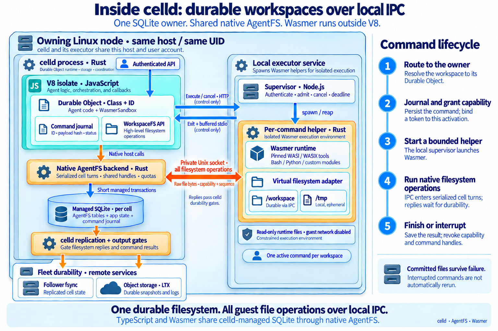

# Durable Wasmer workspaces

Run configured WASI/WASIX tools against the same AgentFS tables used by a
TypeScript Durable Object. celld owns the database, placement and replication.
The executor is a separate, supervised Linux service colocated with the owning
celld node. Every filesystem operation uses a private Unix socket into celld.
TypeScript and Wasmer share the native AgentFS backend and one managed SQLite
connection. The executor never opens a cell database or receives bucket credentials.

This is a constrained backend: Bash/coreutils, Python's standard library and
custom WASI modules; one active command per workspace; buffered UTF-8 stdio;
network access disabled. It is not a Docker replacement or an implementation of
the unmodified `@cloudflare/sandbox` SDK. See [qualification.md](qualification.md)
for retained evidence and deployment boundaries.

## Build and configure

Use the celld binary built from this checkout. Older releases lack the
`ctx.assertCanAwaitCallback()` deadlock guard and are rejected by the SDK.
The executor requires Linux, Node 24.12+ and the pinned Rust dependencies.
macOS is supported only for development tests.

```sh
# From the repository root:
cargo build --release --locked -p celld
cd packages/wasmer-sandbox
npm ci --ignore-scripts
docker build -t celld-wasmer-sandbox:local .

# Use a trusted Wasmer CLI; 7.4.2 was qualified. Downloads happen at setup,
# never during guest execution. Every artifact is checked against tools.lock.json.
WASMER_BIN=/path/to/wasmer node service/fetch-tools.mjs tools
cp service/config.example.json service/config.json
```

Create a private socket directory owned by the UID running celld and the
executor (UID 10001 in the supplied Compose file). Start **each owning celld
node** with `CELLD_AGENTFS_SOCKET=/run/celld-agentfs/fs.sock`. The directory
must already exist with mode 0700; the socket is created with mode 0600.
Mount that same directory into its local executor at `/run/celld-agentfs` and
set `filesystemSocket` in the supervisor config to `/run/celld-agentfs/fs.sock`.
Do not mount the SQLite database into the executor. After a crash, remove a
stale socket only after confirming its owning process has stopped.

Configure these Worker bindings through your normal deployment process:

| Binding | Value |
| --- | --- |
| `SANDBOX_AUTH_ISSUER` | Exact trusted credential issuer |
| `SANDBOX_AUTH_AUDIENCE` | Exact sandbox API audience |
| `SANDBOX_AUTH_JWKS` | JSON public JWKS, pinned by the operator; ES256 signing keys only |
| `SANDBOX_SUPERVISOR_TOKEN` | A distinct random Worker-to-executor token |
| `SANDBOX_SUPERVISOR_URL` | The owning node's local executor, usually `http://127.0.0.1:19877` |
| `WORKSPACES` | Durable Object namespace for `SandboxWorkspace` |

IPC is the SDK default. Each possible owner needs a local executor and private
socket. In Kubernetes use colocated containers, matching UIDs and a shared socket
volume; loopback must reach the executor on that owner. The socket never forwards
to another node. The external API can still route to the owning cell normally.

[example/worker.ts](example/worker.ts) and
[example/wrangler.json](example/wrangler.json) provide the Worker and namespace.
Supply the string bindings in the deployment config's `vars`, using a protected
generated config outside version control. celld stores Worker configuration in
the fleet bucket; access to that bucket is administrator access. No credentials
are embedded in this repository. Generate tokens with `openssl rand -hex 32`.

Start the executor with the matching supervisor token and socket directory:

```sh
export CELLD_SANDBOX_TOKEN='YOUR_SUPERVISOR_TOKEN'
export CELLD_AGENTFS_DIRECTORY='/run/celld-agentfs'
docker compose -f service/compose.yaml up -d --build
```

The Compose service runs as UID 10001 with a read-only root filesystem, no Linux
capabilities, no privilege escalation, 2 GiB memory, two CPUs and 256 PIDs.
Tool files and the socket directory are mounted read-only. Keep the executor's
memory budget separate from celld. Only the celld Worker should possess the
supervisor token. Control requests (execute/cancel and buffered results) still
use authenticated HTTP; filesystem data and heartbeat/sync use local IPC.
The guest's virtual networking implementation denies network access.

Deploy the Worker with your ordinary `celld deploy` workflow. This repository
does not publish images, install cloud infrastructure or alter an existing fleet.
Run the supplied qualification against the target environment before admitting
untrusted production traffic. Pin your built image by digest when deploying it.

## Use the HTTP API

Paths use `/v1/workspaces/<workspace>/<action>`. The workspace is an alias
matching `[A-Za-z0-9_-]{1,128}`. All actions use POST and
`Authorization: Bearer <AGENT_TOKEN>`, a signed credential for exactly one
tenant, agent and workspace. Hexadecimal aliases have no special meaning:
callers cannot select a Durable Object by its raw ID.

The trusted application control plane authenticates its caller, checks who may
act as the requested agent, and issues a short-lived ES256 JWT. Keep its private
key outside celld, the executor and agent environments. This package verifies
credentials with `jose`; it does not provide an identity provider or a public
credential-minting endpoint. Never mint from caller-provided tenant/agent claims
without your application's ownership check.

Required protected header: `alg: ES256`, `typ: sandbox-agent+jwt`, and `kid`.
Required claims: exact `iss` and `aud`, `tenant`, `sub` (the agent ID),
`workspace` (the exact path alias), integer `iat` and `exp`. Tenant and agent IDs
use the same identifier syntax as aliases. Tokens must expire after issuance,
within 300 seconds, and have an age no greater than 300 seconds. Future issuance,
expired tokens and a future `nbf` are rejected, with no clock tolerance. Keep
clocks synchronized. Each JWKS key needs a unique `kid`, `kty: EC`, `crv: P-256`,
`alg: ES256`, `use: sig`, and public `x`/`y`; private key material is rejected.
JWKS URLs or keys supplied by a token are never fetched or trusted.

Both the router and the Durable Object verify the token and derive the object
name from the unambiguous tuple `["sandbox-agent-v1", issuer, tenant, agent,
workspace]`. A direct request to a different object fails authorization.
All file actions, command execution, results/status and cancellation use this
same check. Identity headers, body fields and raw IDs do not override it.
A credential grants all supported actions within that one workspace. Sharing
one agent identity intentionally shares its workspace; issue distinct identities
for agents that must not share. Credentials are bearer secrets: use TLS outside
loopback, avoid logging them, and never pass control-plane credentials to guests.

To rotate keys, deploy overlapping public keys under distinct `kid` values,
start signing with the new key, then remove the old key after its credentials
expire. Each request uses current Worker configuration, with no remote key cache.
Removing a key blocks new requests signed by it; it does not stop already
admitted commands. Token expiry likewise governs admission, not command lifetime.

This is a breaking authorization change. `SANDBOX_API_TOKEN` no longer grants
access, and unscoped legacy object names/IDs are not adopted. Existing workspaces
require an administrator-controlled offline migration that explicitly maps each
old object to its tenant/agent/workspace; this change provides no automatic data
migration. Keep the issuer stable because it is part of workspace identity.
Missing/invalid auth configuration fails closed (503); invalid credentials or
scope fail with a generic 401. Install the new public-key bindings and update
clients to obtain fresh credentials before switching traffic.

```sh
curl "$WORKER/v1/workspaces/agent-42/write" \
  -H "Authorization: Bearer $AGENT_TOKEN" -H 'Content-Type: application/json' \
  -d '{"path":"/workspace/input.txt","data":"aGVsbG8K"}'

curl "$WORKER/v1/workspaces/agent-42/exec" \
  -H "Authorization: Bearer $AGENT_TOKEN" -H 'Content-Type: application/json' \
  -d '{"id":"job-001","tool":"bash","args":["-c","cat input.txt | wc -c"],"cwd":"/workspace","timeoutMs":30000}'

curl "$WORKER/v1/workspaces/agent-42/status" \
  -H "Authorization: Bearer $AGENT_TOKEN" -H 'Content-Type: application/json' \
  -d '{"id":"job-001"}'
```

`exec` accepts `id`, configured `tool`, `args`, `cwd`, `env`, `stdin` and
`timeoutMs`. No shell interpolation is performed: use the configured Bash tool
and `-c` explicitly when desired. The result contains `status`, `startedAt`,
`finishedAt` and `result: {reason, exitCode, stdout, stderr}`. `status` returns
null for an unknown ID. `cancel` accepts `{id}` and closes filesystem admission
immediately; poll `status` for the terminal record. Cancellation preserves
already committed file changes.

Other actions: `read`/`write` (`{path,data}` with base64 data), `stat`, `list`,
`mkdir`, `unlink`, `rmdir` (`{path}`), and `rename` (`{path,to}`). Read returns
`{data}` in base64. Read/write convenience operations are limited to 1 MiB;
guest file descriptors support larger files in bounded chunks. `/fs` is reserved for the explicit HTTP reference backend. IPC mode rejects
filesystem callbacks; the helper is not given an HTTP filesystem URL or token.
The HTTP reference backend requires `SANDBOX_NATIVE_FILESYSTEM=0` and a separate
`SANDBOX_CALLBACK_TOKEN` of at least 32 characters. Its `/fs` route accepts only
raw object IDs plus that internal credential, followed by the existing active
execution token/sequence checks. Agent JWTs cannot use it; callback and supervisor
tokens cannot authorize agent API actions. Keep this reference surface internal
and its tokens out of agents. Trusted Worker code, fleet administrators and the
credential issuer remain inside the trust boundary; arbitrary untrusted Worker
JavaScript is not isolated by this API authorization layer.

## Use TypeScript inside the agent's Durable Object

Use a local workspace dependency on this package (currently private/unpublished),
or import the source paths directly when bundling your Worker:

```ts
import { SandboxWorkspace, routeWorkspace } from "@celld/wasmer-sandbox/worker";

export class Agent extends SandboxWorkspace {
  async runAnalysis(commandId: string) {
    this.sandbox.fs.writeFile("/workspace/input.json", new TextEncoder().encode('{"n":42}'));
    this.ctx.storage.sql.exec("CREATE TABLE IF NOT EXISTS results(id TEXT PRIMARY KEY, status TEXT)");
    const result = await this.sandbox.exec({
      id: commandId,
      tool: "python",
      args: ["-c", "import json; print(json.load(open('/workspace/input.json'))['n'])"],
    });
    this.ctx.storage.sql.exec("INSERT OR REPLACE INTO results VALUES (?,?)", commandId, result.status);
    return result;
  }
}
export default { fetch: routeWorkspace };
```

Bind `WORKSPACES` to your `Agent` class. Its inherited fetch handler serves
the workspace API. `runAnalysis` is an application method; expose it
through your own authorized application handler/RPC boundary. `WasmerSandbox`
is also available as a composition API for existing DO classes on the same owner.

`fs` implements synchronous `readFile`, `writeFile`, `stat`, `list`, `mkdir`,
`rename`, `unlink`, `rmdir`, `open`, `read`, `write`, `truncate`, `fstat` and
`close`. It uses the AgentFS 0.4 format with a corrected managed-storage
implementation. Do not mix it with the unpatched AgentFS 0.6.4 Cloudflare
reader: that reader mishandles sparse/extended files. Application SQL tables
coexist with `fs_*` and `celld_sandbox_commands`; querying them is supported.
Direct writes to those reserved tables bypass SDK invariants and are not part
of the supported contract.

## Execution and durability contract

- One command writes a workspace at a time. DO reads can observe completed
  filesystem operations while `exec` is awaiting. SDK application mutations
  return `EBUSY` during execution. Handles are execution/activation scoped.
- Each write, append, truncate, rename, unlink and bounded file replacement
  commits in a short managed SQLite transaction. Append resolves EOF in that transaction.
  Growth is sparse and reads synthesize zeroes. A multi-call write can leave a
  committed prefix after a trap, cancellation or machine failure.
- Every native operation, including explicit guest sync, reads and errors,
  follows celld's output gates; terminal results do too. Healthy fleets may
  acknowledge from follower fsync; object-store upload is not required per chunk.
- Never hold `transactionSync`, an async storage transaction,
  `blockConcurrencyWhile`, or an application mutex needed by callbacks across
  `exec`. The celld guard rejects the first three before launching a helper.
- Same command ID and canonical payload returns the journaled result/status.
  A different payload is a conflict. An interrupted command is never retried
  automatically. Inspect its files and decide whether a **new** command is safe.
  No exactly-once guarantee is made for arbitrary commands.
- Eviction/reload/ownership takeover constructs a new SDK instance, marks
  `running` records `interrupted` and rejects previous capabilities. The helper
  heartbeat terminates an execution whose owner no longer admits it. CPU-bound
  guests are also bounded by the supervisor's absolute wall-clock deadline.
  There is no stack/memory continuation.
- Results are buffered until completion. Streaming, guest networking, interactive
  sessions, persistent background jobs and preview ports are not exposed.
- Runtime/package files are immutable to the guest. `/workspace` is durable;
  `/tmp` is temporary. Cross-mount rename, symlink/hard-link creation and deletion
  or replacement of an open durable inode are rejected. Close the inode first.

Default limits: 64 MiB logical workspace, 16 MiB/file, 4,096 inodes, 128 handles,
64 KiB per filesystem transfer, 16 MiB of temporary file buffer capacity, eight guest tasks,
64 KiB per stdout/stderr, 64 KiB stdin, 128 arguments, 64 environment entries,
30 seconds per command (120 seconds maximum), two executions per supervisor.
Each Wasm memory is capped at 512 MiB and each table at 1,000,000 elements.
Linux also applies a 128 GiB virtual-address ceiling (reserved address space, not
physical memory), CPU-time limit, 256 file
descriptors and disabled core dumps/no-new-privileges. The service container's
memory/PID limits cover runtime overhead and temporary filesystem metadata.
Limits are rejection boundaries, not quotas silently truncated on success.
Temporary buffer capacity is released when the underlying file is deleted and
its handles are closed; truncation may retain allocated capacity. The pinned
[filesystem patch](runner/vendor/README.md) reserves quota before allocation and
keeps rejected growth from modifying existing files.

The journal stops admitting commands after 10,000 IDs by default. Archive it
under your retention policy while the workspace is idle. Deleting a journal row
ends deduplication for that ID: preserve an external tombstone or never reuse
expired IDs. The SDK deliberately does not silently expire successful IDs.

## Operations and checks

`GET /healthz` reports readiness, active jobs and capacity. Admission returns 503
while the supervisor is full or shutting down. SIGTERM stops admission and kills
active execution groups; the DO records interruption/cancellation. A supervisor
crash can interrupt all its active commands, so choose its capacity and cgroup
budget together. Runner diagnostics are bounded and available through the
`runnerDiagnostic` event and emitted as JSON on the service stderr; guest
stdout/stderr remain separate from those logs.
Keep capabilities and filesystem payloads out of access logs. Rotate by draining commands,
updating both ends, and restarting the executor.

```sh
npm test
npm run check
npm run format:check
cargo test --locked --manifest-path runner/Cargo.toml
cargo clippy --locked --all-targets --manifest-path runner/Cargo.toml -- -D warnings

# From this package directory, after building celld at the repository root:
rustup target add wasm32-wasip1 --toolchain stable
rustup run stable rustc --target wasm32-wasip1 -O test/guest.rs -o test/guest.wasm
cargo build --locked --manifest-path runner/Cargo.toml
SANDBOX_TEST_TOOLS="$PWD/tools/tools.json" npm run test:integration
npm run test:fleet  # needs Docker; creates/removes its own MinIO container
```

Tests use synthetic data and retain logs/results under ignored `test/artifacts`.
The fleet test kills only its own nodes, removes their synthetic working state,
and pauses only its isolated MinIO container. Ports 19876–19877 and 19970–19985
must be free (overridable with `SANDBOX_TEST_PORT`/`SANDBOX_FLEET_PORT`). See the
Linux test Dockerfile and CI workflow for container qualification.

## Native filesystem IPC



See [native-filesystem.md](native-filesystem.md) for the wire protocol, shared
handle authority, transaction boundaries and failure behavior. `nativeFilesystem: false` on the composition API, or `SANDBOX_NATIVE_FILESYSTEM=0` on the supplied
Worker, selects the HTTP reference backend explicitly. That backend additionally
requires `callbackOrigin` and `CELLD_SANDBOX_CALLBACK_TOKEN` on the supervisor and
the matching `SANDBOX_CALLBACK_TOKEN` Worker binding. There is no automatic
fallback from IPC to HTTP.
