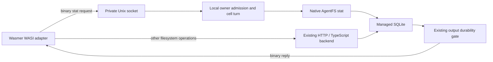

# Historical stat-only experiment

Superseded by the [full native filesystem](native-filesystem.md). The configuration
names, protocol version and benchmark below describe the earlier stat-only commit.

# Native AgentFS stat over local IPC

This opt-in experiment sends Wasmer **path `stat` operations only** to native
AgentFS code in celld over a persistent Unix socket. The normal HTTP backend
remains the default. Reads, writes, open handles, directory operations,
heartbeats, command launch and completion still use the existing HTTP path.
There is no automatic fallback after an IPC failure.

The native operation uses the cell's existing managed SQLite connection. It
runs under the normal cell admission limit, scheduler and isolate lock, without
executing a JavaScript filesystem callback. It never opens the SQLite file in
the helper process. SQLite authorizer/connection limits, paged restore and LTX
replication remain owned by celld.



## Enable locally

Build celld and the runner using the package's normal build instructions. Create
a short, absolute socket path in a directory owned by their service UID:

```sh
mkdir -m 700 /tmp/celld-agentfs
export CELLD_EXPERIMENTAL_AGENTFS_SOCKET=/tmp/celld-agentfs/fs.sock
# Start celld with this environment.
```

Add `"nativeStatSocket": "/tmp/celld-agentfs/fs.sock"` to the supervisor JSON
configuration. Add `SANDBOX_EXPERIMENTAL_NATIVE_STAT: "1"` to the Worker vars,
or use `experimentalNativeStat: true` when constructing `WasmerSandbox`.
The socket path is supervisor configuration; a command cannot choose it.
Both processes must see the same socket and run as the same UID. A container
needs the private socket directory mounted, not the SQLite database.

Startup refuses an existing socket. After a crash, verify the old process has
stopped before removing its stale socket and restarting. The listener is absent
unless the celld environment variable is set. The default Compose file does
not enable this experiment or arrange per-owner executor placement.

## Authority and failure behavior

- A fresh random command token grants one in-memory stat capability on the
  current storage activation. It is not written to SQLite, replicated or
  restored. Replacing/closing the activation drops it.
- Cancellation revokes admission before contacting the supervisor. Completion
  and lost supervisor responses also revoke it. Every request checks expiry
  and a strictly increasing sequence, with at most 100,000 requests per grant.
- Requests only serve an already resident local owner. They never forward to
  another node. The normal actor request/output gate checks ownership; a
  takeover requires a newly placed executor and a new command capability.
- The socket parent requires mode `0700`; the socket uses `0600`. Frames are
  at most 8 KiB, with 32 connections, one operation in flight per connection,
  bounded partial-frame/output waits, and an idle timeout. The supervisor's
  existing command deadline also bounds the helper lifetime.
- Native stat rejects an active input-gate critical section or SQL transaction
  with `EBUSY` rather than entering it. The helper treats that error, stale
  authority, malformed replies and transport loss as an execution failure.
- Successful reads and filesystem errors pass the existing durability output
  gate with a position sampled in the same managed-storage turn. The socket
  does not turn a local read into permission to expose unreplicated state.
- `/workspace` confinement, unsupported symlinks/inode types, schema version,
  maximum depth and component lengths are checked natively. The wire path
  limit is 4,096 UTF-8 bytes. This is an intentionally narrow AgentFS 0.4
  implementation, not a general SQLite RPC service.

## Reproduce the checks and benchmark

From the repository root:

```sh
cargo build --locked -p celld
cargo test --locked -p celld --lib agentfs::tests
cargo test --locked -p celld-agentfs-ipc
cd packages/wasmer-sandbox
npm run check
npm test
cargo test --locked --manifest-path runner/Cargo.toml
cargo build --locked --manifest-path runner/Cargo.toml
rustup run stable rustc --target wasm32-wasip1 -O test/guest.rs -o test/guest.wasm
SANDBOX_NATIVE_STAT=1 SANDBOX_BENCH=1 npm run test:integration
SANDBOX_NATIVE_STAT_FLEET=1 npm run test:fleet
```

Set `SANDBOX_TEST_TOOLS` to the pinned catalog to include Bash, coreutils and
Python. `CELLD_WASMER_RUNNER` and `CELLD_BIN` can override the executable paths.
Use `SANDBOX_NATIVE_STAT=1` with the documented Linux qualification container
command to run the native path under its existing resource/privilege limits.
Each harness writes a `results.json` and removes only its own socket directory.

The benchmark executes the same guest, file and cell with the same durability
gates, alternating HTTP/native order for eight pairs. Pair zero is warmup.
Each measured guest does 1,000 real metadata calls and checks their returned
sizes. The runner reports how many stat calls used each transport; the test
requires the chosen transport to handle the entire loop. Guest timing excludes
compilation/launch; command wall time is retained separately.

Local macOS arm64 debug-build results on September 22, 2026:

| 1,000 path stat calls | Median guest time |
| --- | ---: |
| Existing HTTP / JavaScript | 870.888 ms |
| Persistent binary IPC / native | 160.212 ms |

That is **5.44x** for this metadata loop. It combines the effects of connection
reuse, binary transport and native traversal; it does not isolate their
individual contributions. It is not a production throughput claim, a write
benchmark, or a prediction for large sequential file I/O. Raw paired samples
are retained in [evidence/ipc-benchmark-macos.json](evidence/ipc-benchmark-macos.json).

## Verified locally

| Check | Result | Evidence |
| --- | --- | --- |
| TypeScript filesystem, journal, capability lifecycle and supervisor tests | 15 passed | [unit tests](evidence/ipc-unit-tests.txt) |
| Native AgentFS path/capability tests | 2 passed | [native tests](evidence/ipc-native-tests.txt) |
| Bounded binary codec tests | 2 passed | [protocol tests](evidence/ipc-protocol-tests.txt) |
| Runner bounds, quota, transport loss and connection reuse tests | 10 passed | [runner tests](evidence/ipc-runner-tests.txt) |
| Native IPC integration on macOS arm64 | 15 checks passed | [macOS](evidence/ipc-macos.json) |
| Native IPC in restricted Linux arm64 container | 15 checks passed; exit 0; no OOM kill | [Linux](evidence/ipc-linux.json) |
| Default HTTP backend in the same Linux image | 12 checks passed; exit 0; no OOM kill | [HTTP baseline](evidence/ipc-http-linux.json) |
| Three celld processes and MinIO | 5 fault checks passed | [fleet](evidence/ipc-fleet.json) |

Both integration platforms exercised the pinned Bash, coreutils and Python
packages, cancellation, restart without the local runtime directory, and
owner-process loss. Native checks cover malformed frames, path confinement,
invalid credentials, replayed sequences, expiry, input-gate exclusion,
revocation and refusal to restore capabilities from LTX.

The fleet test first acknowledges writes through a follower while the bucket
is paused, then loses the owner and its disk. A capability from that activation
is rejected on the new owner. It also exercises owner suspension/takeover and
self-fencing. Finally, with only one node left, it pauses MinIO, confirms a new
write has reached managed SQLite, and checks that native stat cannot reveal
that write until the bucket recovers. This uses the real output gate.

Strict TypeScript, Prettier, Rust formatting and Clippy with warnings denied
passed. [Build metadata](evidence/ipc-build.json) records the local source
snapshot, toolchains, image IDs and container exit states. The expanded GitHub
workflow has not run remotely. Linux x86-64, a deployed multi-host executor
placement scheme, arbitrary native operations and production workload targets
remain outside this experiment's qualification.

## Scope before a full backend

This is a runnable experiment, not a production filesystem cutover. The next
step is to move the remaining operations into a shared native implementation,
including activation-scoped handles, atomic append, quota enforcement,
transaction boundaries, error parity and binary file payloads. That work also
needs full mutation parity/fault tests and a per-owner supervisor placement
strategy. The existing TypeScript implementation remains authoritative for
those operations. No Turso migration, shared database mount or new SQLite
connection is introduced here.
